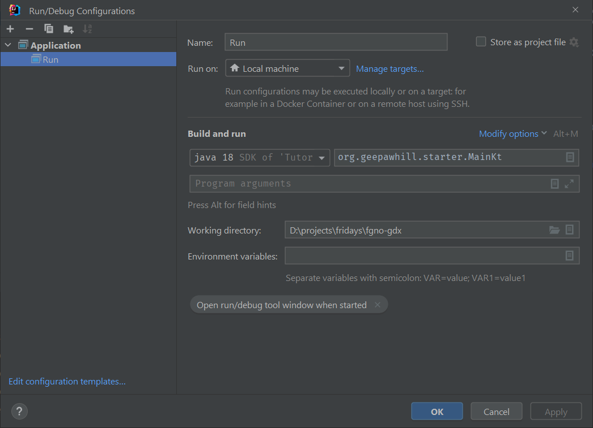

# fgno-tornadofx
A Repo for playing with gdx.
Friday night crew.

Getting This To Build.

1) Clone it. Open it with intellij by pointint at the pom.xml file and saying "open as project".

2) It should sync.

3) You need a run configuration. Mine looks like this:

4) If you are on the mac, you will have to add more to your run configuration. If you click on the blue underlined "Modify options", one of your choices is to add VM options. It will show a new edit box in the run configuration, which, frankly, is terrible UX. Paste in `-XstartOnFirstThread`